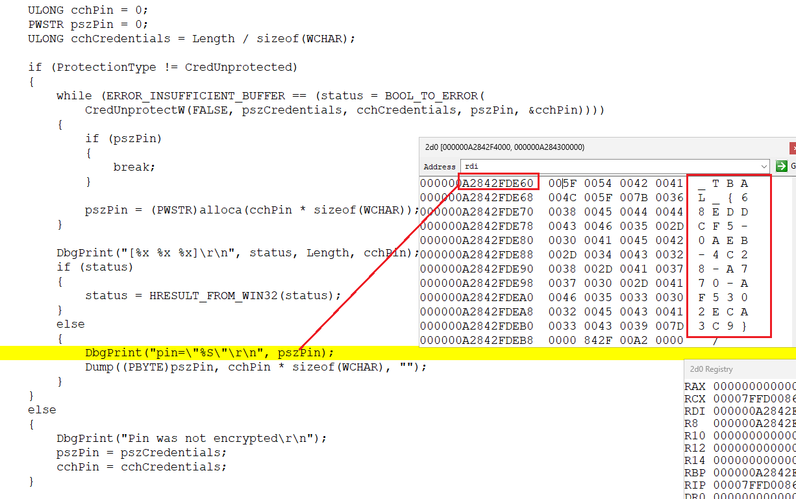
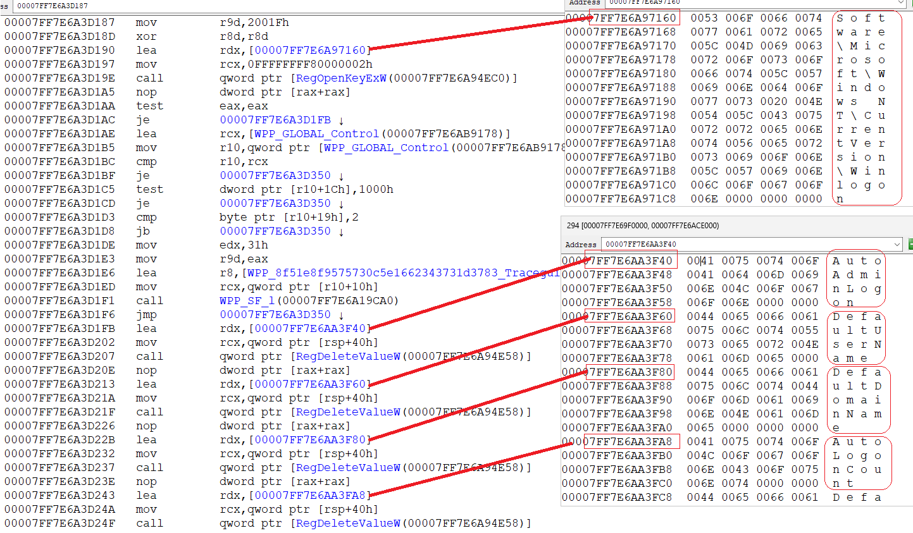
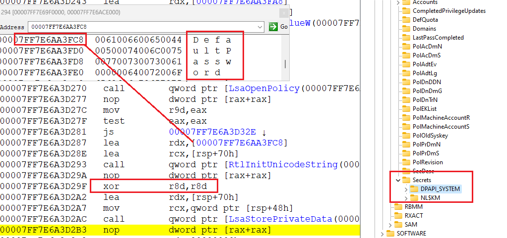
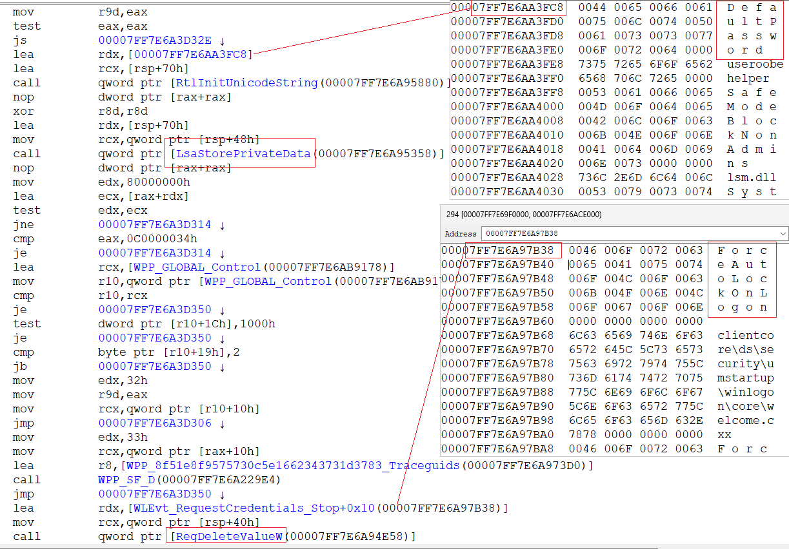
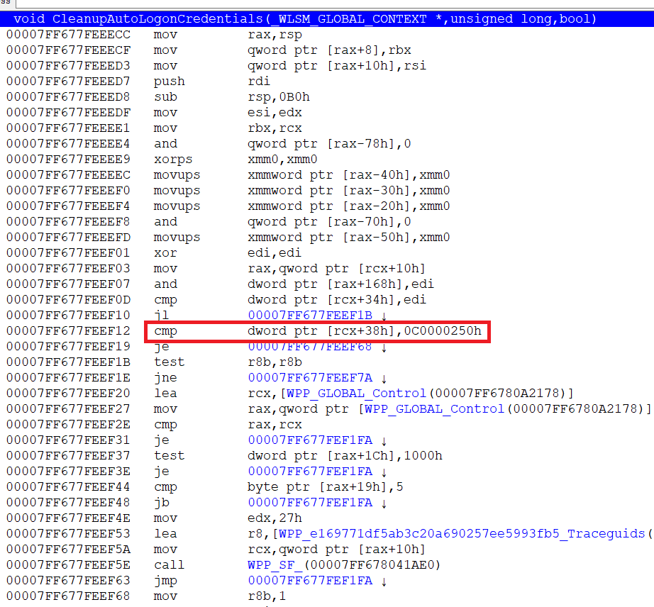
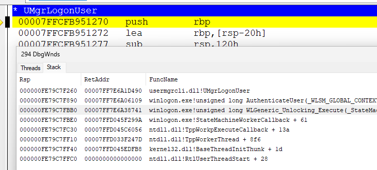
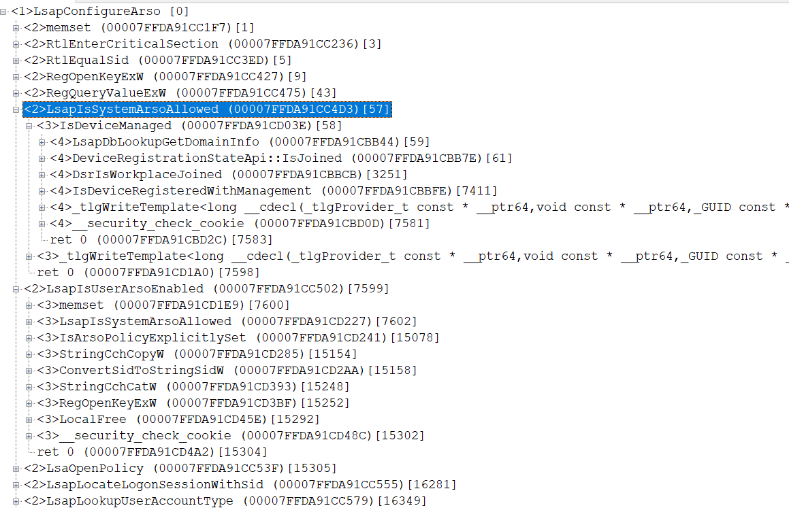
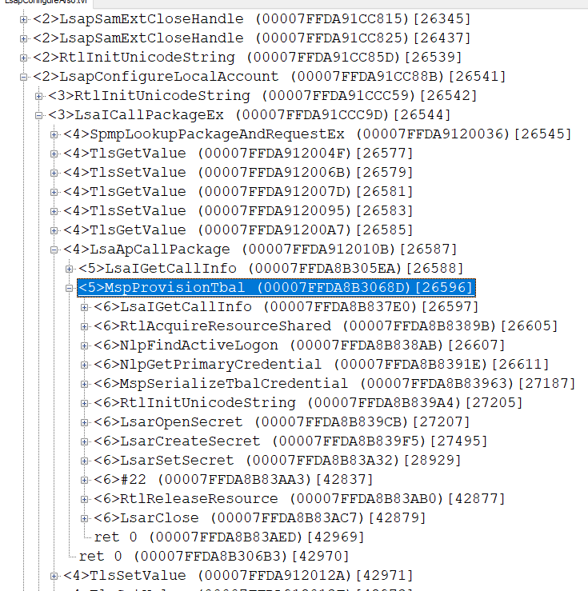
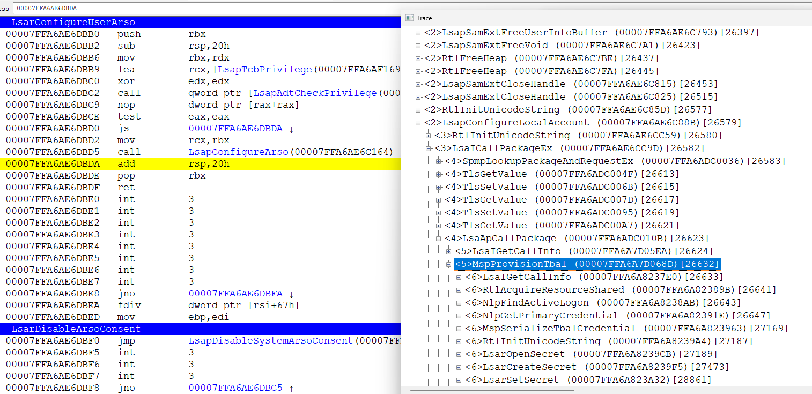

when I was testing my authentication package I noticed that when I logged in after shutdown/reboot the user token didn't have a SID which should have been there ( `S-1-5-65-1` `THIS_ORGANIZATION_CERTIFICATE`) and there was a SID , which shouldn't be there ( `S-1-5-64-10` `NT AUTHORITY\NTLM Authentication`). i looked at the *AuthenticationPackage* that created the session - `NTLM`. even though I was logging in through my authentication package.

but if I did logoff and then logon using my *AuthenticationPackage* - everything was correct - `THIS_ORGANIZATION_CERTIFICATE` in token groups and my module name in `SECURITY_LOGON_SESSION_DATA::AuthenticationPackage`. looking at the log from my package, I saw that the session that I created was destroyed. everything looked as if it was not a logon but an unlock. but how?

to debug *LogonUI/winlogon/lsass* processes, I replace *utilman.exe* with *cmd.exe* in the system. already from this cmd you can run debugger and other utilities. and *utilman.exe* (i.e. cmd.exe ) can be called from LogonUI. running debugger after reboot on winlogon desktop, and looking at what processes are running, I suddenly noticed a strange thing (for the first time, although before that I also ran debugger dozens or hundreds of times) - *explorer.exe* in terminal session id != 0 is already running and after logging in through my package, the same explorer (process id didn't change). it means unlock actually happened and not logon at system startup. that is, the system automatically did the logon itself and then the lock, and when you entered user credentials, it turned out to unlock the existing session

experimenting - I realized that this was actually not always the case.
the system did autologon + lock only if at the time of pressing shutdown or reboot - a certain user was active in the system. the data of the current active logon session was saved. but if you first logoff and then shutdown / reboot (that is, at the moment when there is no active user) - autologon did not occur. it did not occur during an emergency shutdown of the computer (just by turning off the power, for example). it is obvious that some data was recorded and then used during shutdown. and they were taken from the current active (interactive) session. if there was no such session, then nothing was recorded - and autologon did not occur at the next start. obviously this data was erased immediately after autologon

you can also notice that in the case of autologon - after entering use credentials - logging in was very fast. almost instantly. the user desktop appeared immediately, completely ready for work. without autologon - after entering credentials - the login/initialization process took a few more seconds. the difference was very noticeable.

if we logged in under a different user - not the one that shutdown / reboot did - then there was already a logon and not an unlock. and after that there were already 2 interactive user sessions at once - one locked and one under which we entered.

formally let's have 2 users - user1 and user2
computer turned off or rebooted from user1 session
as a result, the next time you turn it on - while we see the logonui interface on winlogon desktop - automatically, on the default desktop, a session for user1 is started (of course, we do not see this with winlogon desktop)

if we enter credentials (password or something else) for user1 - an unlock occurs, an already ready session. and everything happens very quickly - from the point of view of a person - instantly

if we enter credentials for user2, then logon occurs - creating a new session, launching userint, which launches explorer (we assume that these programs are not replaced in the registry), initializing explorer .. all this takes a few seconds. and the delay is noticeable. thus already existing session, for user1, and remains to hang in storage. obviously taking up memory. and also probably some secrets ( sha1 password hash of user1 for example), which now, in principle, user2 can get

why is this done at all? What's the point ? from my point of view, this is **Speculative execution**:

> Speculative execution is an optimization technique where a computer system performs some task that may not be needed. Work is done before it is known whether it
> is actually needed, so as to prevent a delay that would have to be incurred by doing the work after it is known that it is needed. If it turns out the work was
> not needed after all, most changes made by the work are reverted and the results are ignored.

in fact, the system makes a (reasonable) assumption - that if user1 turned off or rebooted the system, then the same user1 will enter it after turning it on (for personal computers with one user - this is almost always the case). user input credentials - usually takes a few seconds. the system, instead of being idle for these seconds, waiting for input, immediately starts a session for user1 (starting userinit which starts explorer). by the time the user has entered his password (or something else) - as a rule, explorer and user desktop are already ready. all you need to do after checking the credentials is to switch desktop - from winlogon to default. as a result, we have a gain of several seconds

if all the same we enter credentials for another user user2, then the system did not guess correctly. You have to run the full logon process. and at the same time there is an obvious minus - the result of Speculative execution - is not discarded - but remains to hang in memory. I take a part (albeit not a lot) of resources

but what is it called anyway? After all, this is probably a well-known (albeit little) thing. how to find information about it in google? what owls to look for? not obvious. so I decided to investigate the process itself in detail - how this autologon happens.

since the session is created by `NTLM`, then `LsaApLogonUserEx2` is called from `msv1_0`. I put a hook on this function from my auth package, and from the hook I launched cmd and waited for the debugger to attach to our (lsass) process.

here is something like this code can be used to run *cmd* from *lsass*

```
void StartCmd(ULONG SessionId, PCWSTR lpApplicationName, PCWSTR lpCurrentDirectory)
{
    NTSTATUS status;
    HANDLE hToken, hNewToken;

    if (0 <= (status = NtOpenProcessToken(NtCurrentProcess(), TOKEN_DUPLICATE, &hToken)))
    {
        status = NtDuplicateToken(hToken,
            TOKEN_ADJUST_SESSIONID|TOKEN_ADJUST_DEFAULT|TOKEN_ASSIGN_PRIMARY|TOKEN_QUERY|TOKEN_DUPLICATE,
            0, FALSE, TokenPrimary, &hNewToken);

        NtClose(hToken);

        if (0 <= status)
        {
            if (0 <= (status = NtSetInformationToken(hNewToken, TokenSessionId, &SessionId, sizeof(SessionId))))
            {
                STARTUPINFOW si = { sizeof(si) };
                si.lpDesktop = const_cast<PWSTR>(L"WinSta0\\Winlogon");
                PROCESS_INFORMATION pi;

                if (CreateProcessAsUserW(hNewToken, lpApplicationName, 0, 0, 0, 0, 0, 0, lpCurrentDirectory, &si, &pi))
                {
                    NtClose(pi.hThread);
                    NtClose(pi.hProcess);

                    DbgPrint("cmd created !\r\n");
                    while (!IsDebuggerPresent())
                    {
                        Sleep(1000);
                    }
                    __debugbreak();

                }
                else
                {
                    DbgPrint("CP = %x(%u)\r\n", RtlGetLastNtStatus(), GetLastError());
                }
            }
            NtClose(hNewToken);
        }
    }
}

void StartCmd()
{
    int SessionId = WTSGetActiveConsoleSessionId();
    if (0 <= SessionId)
    {
        PWSTR lpApplicationName = 0;
        ULONG cch = 0;
        while (cch = GetEnvironmentVariableW(L"ComSpec", lpApplicationName, cch))
        {
            if (lpApplicationName)
            {
                PWSTR lpCurrentDirectory = 0;
                cch = 0;

                while (cch = GetWindowsDirectoryW(lpCurrentDirectory, cch))
                {
                    if (lpCurrentDirectory)
                    {
                        StartCmd( SessionId, lpApplicationName, lpCurrentDirectory);
                        break;
                    }

                    lpCurrentDirectory = (PWSTR)alloca( cch * sizeof(WCHAR));
                }

                break;
            }

            lpApplicationName = (PWSTR)alloca( cch * sizeof(WCHAR));
        }
    }
}
```

после запуска cmd/debugger - будем висеть в цикле
                   
дальше нужно посмотреть - а по какому паролю система входит ? 

```
    PKERB_INTERACTIVE_LOGON pkil = (PKERB_INTERACTIVE_LOGON)ProtocolSubmitBuffer;

    CRED_PROTECTION_TYPE ProtectionType;

    NTSTATUS status = Lsa(ImpersonateClient());

    DbgPrint("ImpersonateClient=%x\r\n", status);

    if (0 <= status)
    {
        ULONG Length = pkil->Password.Length;
        PWSTR pszCredentials = (PWSTR)alloca(Length + sizeof(WCHAR));
        memcpy(pszCredentials, RtlOffsetToPointer(pkil, pkil->Password.Buffer), Length);
        *(PWSTR)RtlOffsetToPointer(pszCredentials, Length) = 0;

        status = GetLastHr(CredIsProtectedW(pszCredentials, &ProtectionType));

        DbgPrint("CredIsProtectedW=%x, %x\r\n", status, ProtectionType);

        ULONG cchPin = 0;
        PWSTR pszPin = 0;
        ULONG cchCredentials = Length / sizeof(WCHAR);

        if (ProtectionType != CredUnprotected)
        {
            while (ERROR_INSUFFICIENT_BUFFER == (status = BOOL_TO_ERROR(
                CredUnprotectW(FALSE, pszCredentials, cchCredentials, pszPin, &cchPin))))
            {
                if (pszPin)
                {
                    break;
                }

                pszPin = (PWSTR)alloca(cchPin * sizeof(WCHAR));
            }

            DbgPrint("[%x %x %x]\r\n", status, Length, cchPin);
            if (status)
            {
                status = HRESULT_FROM_WIN32(status);
            }
            else
            {
                DbgPrint("pin=\"%S\"\r\n", pszPin);
                Dump((PBYTE)pszPin, cchPin * sizeof(WCHAR), "");
            }
        }
        else
        {
            DbgPrint("Pin was not encrypted\r\n");
            pszPin = pszCredentials;
            cchPin = cchCredentials;
        }

        DbgPrint("status=%x\r\n", status);

        RevertToSelf();
    }
```




паролем оказалась строка `_TBAL_{68EDDCF5-0AEB-4C28-A770-AF5302ECA3C9}`

вот мы и получили кое что уникальное, для поиска в google. информации немного, но она есть
- [DPAPI security flaw in Windows 10](https://www.passcape.com/index.php?section=blog&cmd=details&id=38)
* [TBAL: an (accidental?) DPAPI Backdoor for local users](https://vztekoverflow.com/2018/07/31/tbal-dpapi-backdoor/)
+ [Winlogon automatic restart sign-on (ARSO)](https://learn.microsoft.com/en-us/windows-server/identity/ad-ds/manage/component-updates/winlogon-automatic-restart-sign-on--arso-)

в принципе практически всё уже описано, но - можно всё таки ещё посмотреть во всех деталях

кто вызывает `LsaLogonUser` ? как и можно было ожидать - *winlogon* - всё начинается там. строго говоря, сейчас *winlogon* не вызывает напрямую `LsaLogonUser`, а вызывает `UMgrLogonUser` из `usermgrcli`, который делает *RPC (alpc)* вызов в `USERMGR.DLL` ( живёт в одном из *svchost*) который уже вызывает `LsaLogonUser`. зачем это делается, зачем нужен посредник - ``USERMGR - не знаю. но с принципиальной точки зрения - не важно. инициатор *winlogon*

всё начинается в функции

```
ULONG WLGeneric_Authenticating_Execute(StateMachineCallContext *);
```

она проверяет наличие/значение ForceAutoLockOnLogon

в "SOFTWARE\Microsoft\Windows NT\CurrentVersion\Winlogon" ключе - и если есть - вызывает 

```
ULONG AuthenticateUser(
	WLSM_GLOBAL_CONTEXT *, 
	SECURITY_LOGON_TYPE,void *, 
	CRED_PROV_CREDENTIAL *, 
	LUID *,
	void * *, 
	QUOTA_LIMITS *,
	void * *,
	unsigned long *,
	long *,
	long *,
	int *);
```

который в свою очередь вызывает `UMgrLogonUser` а тот - `LsaLogonUser` ( в другом процессе)


после этого вызывается функция 

`void` [`CleanupAutoLogonCredentials`](https://github.com/rbmm/TVI/blob/main/DEMO/CleanupAutoLogonCredentials.tvi)`(WLSM_GLOBAL_CONTEXT *, ULONG, BOOLEAN);`

эта функция и удаляет значения реестра, с помощью которых и происходит aulologon (+lock)
до её вызова, реестр выглядит вот  так


а вот и код из неё



and



последним удаляется ForceAutoLockOnLogon, который и проверяется изначально в WLGeneric_Authenticating_Execute



на само дерево вызовов LsaApLogonUserEx2 
можно посмотреть в [LsaApLogonUserEx2_TBAL.tvi](https://github.com/rbmm/TVI/blob/main/DEMO/LsaApLogonUserEx2_TBAL.tvi)
с помощью утилиты [tvi.exe](https://github.com/rbmm/TVI/blob/main/X64/tvi.exe) ( для правильной регистрации в системе, нужно её изначально запустить один раз as admin - тогда потом она будет автоматом открывать .tvi файлы)
и для сравнения - логон без TBAL - [LsaApLogonUserEx2.tvi](https://github.com/rbmm/TVI/blob/main/DEMO/LsaApLogonUserEx2.tvi)

можно увидеть вызовы - MsvpGetTbalCredentials - MsvpGetTbalPrimaryCredentialsFromSecret - RtlEqualUnicodeString

один примечательный момент - в случае LsaApLogonUserEx2 по TBAL - LsaLogonUser function (ntsecapi.h) - Win32 apps | Microsoft Learn в SubStatus
возвращается значение STATUS_INSUFFICIENT_LOGON_INFO ( There is insufficient account information to log you on. )
хотя по документации - 

If the logon failed due to account restrictions, this parameter receives information about why the logon failed. This value is set only if the account information of the user is valid and the logon is rejected.

и в LSA_AP_LOGON_USER (ntsecpkg.h) - Win32 apps | Microsoft Learn
[out] SubStatus

Pointer to an NTSTATUS that receives the reason for failures due to account restrictions. 


в случае TBAL logon не failed but STATUS_INSUFFICIENT_LOGON_INFO ( (NTSTATUS)0xC0000250L )

это значение, специально проверяется в CleanupAutoLogonCredentials




так примерно происходит autologon.

в случае же unlock - вызывается другая функция



если логон успешный - вызывается функция 

```
NTSTATUS LsapUpdateNamesAndCredentials(
	_In_ SECURITY_LOGON_TYPE LogonType, 
	_In_ PLUID LogonId, 
	_In_ PUNICODE_STRING AccountName,
	_In_ PSECPKG_PRIMARY_CRED PrimaryCredentials,
	_In_ PSECPKG_SUPPLEMENTAL_CRED_ARRAY SupplementalCredentials);
```

и в ней

```
if (LogonType == Interactive) LsapArsoNotifyUserLogon(..);
```

внутри

```
void LsapArsoNotifyUserLogon(_In_ LUID LogonId);
```

вызывается в частности UpdateARSOSid(LogonSession->UserSid)

которая сохраняет текущий Sid в глобальной переменной 

```
PSID g_ArsoSid;
void UpdateARSOSid(_In_ PSID UserSid);
```

**************************************************************************************************************

а как сохраняется информация для него при shutdown/reboot ?

если поискать по слову Arso то следующие функции экспортируются:

```
// exported from winlogonext.dll
WINBASEAPI NTSTATUS WINAPI ConfigureUserArso(_In_opt_ PSID UserSid)

// exported from advapi32
WINADVAPI NTSTATUS NTAPI LsaEnableUserArso(_In_ PSID UserSid);
WINADVAPI NTSTATUS NTAPI LsaDisableUserArso(_In_ PSID UserSid)
WINADVAPI NTSTATUS NTAPI LsaIsUserArsoEnabled(_In_opt_ PSID UserSid, _Out_ PBOOL pbEnabled);
WINADVAPI NTSTATUS NTAPI LsaIsUserArsoAllowed(_Out_ PBOOL pbAllowed);

// exported from PinEnrollmentHelper.dll
WINBASEAPI HRESULT NTAPI IsArsoAllowedByPolicy(_Out_ PBOOL pbAllowed);
{
	NTSTATUS status = LsaIsUserArsoAllowed(pbAllowed);
	return 0 > status ? wil::details::in1diag3::Return_NtStatus(_ReturnAddress(), 0, 0, status) : S_OK;
}
```

все они делают RPC call to LSASRV.DLL, which executed in LSASS.EXE

```
NTSTATUS LsapIsSystemArsoAllowed(_In_ BOOLEAN bLog, _Out_ PBOOL pbAllowed, _Out_opt_ PBOOL pbSecure);

NTSTATUS LsarIsUserArsoAllowed(void*, _Out_ PBOOL pbAllowed)
{
	return LsapIsSystemArsoAllowed(FALSE, pbAllowed, 0);
}

NTSTATUS LsarIsArsoAllowedByPolicy(void*, _Out_ PBOOL pbAllowed)
{
	return LsapIsSystemArsoAllowed(FALSE, pbAllowed, 0);
}

NTSTATUS LsapSetUserArsoOptIn(_In_ PSID UserSid, _In_ BOOLEAN bEnable)
{
	HKEY_LOCAL_MACHINE\SOFTWARE\Microsoft\Windows NT\CurrentVersion\Winlogon\UserARSO\$(UserSid)\OptOut = !bEnable;
}

NTSTATUS LsarDisableUserArso(void*, _In_ PSID UserSid)
{
	return LsapSetUserArsoOptIn(UserSid, FALSE);
}

NTSTATUS LsarEnableUserArso(void*, _In_ PSID UserSid)
{
	return LsapSetUserArsoOptIn(UserSid, TRUE);
}

NTSTATUS LsarIsUserArsoEnabled(void*, _In_opt_ PSID UserSid, _Out_ PBOOL pbEnabled) 
{
     return LsapIsUserArsoEnabled(UserSid, pbEnabled, 0);
}

NTSTATUS LsapIsUserArsoEnabled(_In_opt_ PSID UserSid, _Out_ PBOOL pbEnabled, _Out_opt_ PBOOL pbOptOutExist)
{
	*pbEnabled = FALSE;
	BOOL bAllowed, bOptOutExist = FALSE;
	NTSTATUS status = LsapIsSystemArsoAllowed(0, &bAllowed, 0);
	if (0 <= status && bAllowed)
	{
		if (IsArsoPolicyExplicitlySet())
		{
			*pbEnabled = TRUE;
		}
		else if (UserSid || (UserSid = g_ArsoSid))
		{
			HKEY hKey = Open("HKEY_LOCAL_MACHINE\SOFTWARE\Microsoft\Windows NT\CurrentVersion\Winlogon\UserARSO\$(UserSid)");

			*pbEnabled = TRUE;
						
			ULONG Type, OptOut, cb = sizeof(OptOut);
			if (NOERROR == RegQueryValueExW(hKey, L"OptOut", 0, &Type, &OptOut, &cb) && Type == REG_DWORD && cb == sizeof(OptOut))
			{
				*pbEnabled = !OptOut;
				bOptOutExist = OptOut < 2;
			}
			
			RegCloseKey(hKey);
		}
		else
		{
			status = STATUS_NO_SUCH_USER;
		}
	}
	
	if (pbOptOutExist) *pbOptOutExist = bOptOutExist;
	
	return status;
}

BOOL IsArsoPolicyExplicitlySet()
{
    // Query MACHINE\SOFTWARE\Microsoft\Windows\CurrentVersion\Policies\System
    // for DisableAutomaticRestartSignOn and AutomaticRestartSignOnConfig
    // https://learn.microsoft.com/en-us/windows-server/identity/ad-ds/manage/component-updates/winlogon-automatic-restart-sign-on--arso-
}

NTSTATUS LsapConfigureArso(_In_opt_ PSID UserSid);

NTSTATUS LsarConfigureUserArso(_In_opt_ PSID UserSid)
{
  NTSTATUS status = LsapAdtCheckPrivilege(&LsapTcbPrivilege);
  if (0 <= status) status = LsapConfigureArso(UserSid);
  return status;
}
```

и так, нужно поставить breakpoint на LsapConfigureArso


опять таки сделать это прямо сложно, учитывая что пользовательская сессия в этот момент уже почти убита ( точнее процессы в ней). 
но здесь можно применить туже технику что и в начале - hook + StartCmd()


запускаем дебагер и атачимся к lsass


прежде всего смотрим - а кто же нас вызвал ?
вызов идёт из winlogon


вызывается 

WINBASEAPI NTSTATUS WINAPI ConfigureUserArso(_In_opt_ PSID UserSid); 
из winlogonext.dll




и так вызов ConfigureUserArso из winlogon - приводит к вызову LsapConfigureArso из lsass (lsasrv.dll)
в принципе можно и самостоятельно вызвать эту api. если у нас есть TCB privilege. 
а их элементарно получить, если у нас есть S-1-5-32-544 в группах. а они есть, если мы run as amdin

что же внутри LsapConfigureArso ?

смотрим [LsapConfigureArso.tvi](https://github.com/rbmm/TVI/blob/main/DEMO/LsapConfigureArso.tvi)


1. вся работа внутри EnterCriticalSection(&g_autoLogonCritSec); .. LeaveCriticalSection(&g_autoLogonCritSec);
2. если возникает ошибка, она логируется SpmpEventWrite(&LSA_CONFIGURE_AUTOLOGON_CREDENTIALS_FAILURE, L"e", status);
3. проверяется глобальная переменная BOOLEAN g_bSecrets - если TRUE - возращается ERROR_ALREADY_EXISTS
4. проверяется PSID g_ArsoSid ( его устанавливает UpdateARSOSid ) - если 0 - возвращается STATUS_NO_SECRETS
5. если UserSid != 0 - он сравнивается с g_ArsoSid и если не совпадает - возвращается STATUS_ACCESS_DENIED
6. в ключе HKEY_LOCAL_MACHINE\SOFTWARE\Microsoft\Windows NT\CurrentVersion\Winlogon проверяется AutoAdminLogon и если он 1 - возращается ERROR_ALREADY_EXISTS
7. вызывается LsapIsSystemArsoAllowed, и если не allowed - STATUS_ACCESS_DENIED


8. если UserSid != 0 то проверяется LsapIsUserArsoEnabled(UserSid, &, &) а если 0 - то
    2 == GetSystemArsoConsentValue() ? STATUS_ACCESS_DENIED : STATUS_SUCCESS;

ULONG GetSystemArsoConsentValue();

читает значение из "SOFTWARE\\Microsoft\\Windows NT\\CurrentVersion\\Winlogon"  @ "ARSOUserConsent"
https://thewincentral.com/windows-10-faster-logons-after-an-os-update-or-upgrade/

также есть такая системная функция

```
NTSTATUS LsarIsArsoAllowedByConsent(PVOID, PBOOLEAN pbEnabled)
{
    *pbEnabled = 2 != GetSystemArsoConsentValue();
    return STATUS_SUCCESS;
}
```

тоесть значение 2 в "ARSOUserConsent" запрещает ARSO/TBAL а любое другое значение (или отсутствие значения) разрешает
кстати Lsar говорит что должна быть функция в другой длл,которая по rpc вызывает её
но нигде нет IsArsoAllowedByConsent


9. если все проверки пройдены успешно - система смотрит на LsapLookupUserAccountType -
в частности для Protected Users ( https://learn.microsoft.com/en-us/windows-server/security/credentials-protection-and-management/protected-users-security-group )
ARSO не разрешенно

...много вызовов в SAM

10. если всё успешно - вызывается (в зависимости от типа аккаунта) -
```
NTSTATUS LsapConfigureLocalAccount(_In_ LUID LogonId);
```

или 

```
NTSTATUS LsapConfigureCloudCache(_In_ LUID LogonId);
```

LsapConfigureLocalAccount - это вызов в MSV1_0_PACKAGE_NAME с MsV1_0ProvisionTbal
( вызывается MspProvisionTbal, которая если вызов не из lsass процесса а через LsaCallAuthenticationPackage возвращает STATUS_ACCESS_DENIED если не активен kernel debugger)
LsapConfigureCloudCache вызывает CloudAP_GenARSOPwd


здесь и сохраняются user credentials




и выходим из функции




любопытно, что MspProvisionTbal можно вызвать напрямую ( не через ConfigureUserArso )
если посмотреть в ntsecapi.h
то в
```
MSV1_0_PROTOCOL_MESSAGE_TYPE
```
есть

```
#if (_WIN32_WINNT >= 0x0A00)
    MsV1_0TransferCred,
    MsV1_0ProvisionTbal,
    MsV1_0DeleteTbalSecrets,
#endif
```
то есть надо вызывать LsaCallAuthenticationPackage

входная структура данных не документирована. но её не сложно понять

```
typedef struct MSV1_0_PROVISION_TBAL {
    MSV1_0_PROTOCOL_MESSAGE_TYPE MessageType;
    LUID LogonId;
} *PMSV1_0_PROVISION_TBAL;
```

фактически в качестве параметра - нужно передать LUID LogonId; для которой мы хотим сохранить credentials. ну и понятно нам нужен TCB

примерный код - 

```
        HANDLE LsaHandle;

        if (0 <= LsaConnectUntrusted(&LsaHandle))
        {
            ULONG ulAuthPackage;
            STATIC_ANSI_STRING(msv1, MSV1_0_PACKAGE_NAME);

            if (0 <= (LsaLookupAuthenticationPackage(
                LsaHandle, const_cast<PLSA_STRING>(&msv1), &ulAuthPackage)))
            {

                MSV1_0_PROVISION_TBAL tbal = { MsV1_0ProvisionTbal };

                ULONG LogonSessionCount;
                PLUID LogonSessionList;

                if (0 <= LsaEnumerateLogonSessions(&LogonSessionCount, &LogonSessionList))
                {
                    if (LogonSessionCount)
                    {
                        LogonSessionList += LogonSessionCount;
                        do
                        {
                            PSECURITY_LOGON_SESSION_DATA LogonSessionData;
                            if (0 <= LsaGetLogonSessionData(--LogonSessionList, &LogonSessionData))
                            {
                                STATIC_UNICODE_STRING(NTLM, NTLMSP_NAME_A);

                                if (LogonSessionData->LogonType == Interactive &&
                                    RtlEqualUnicodeString(&LogonSessionData->AuthenticationPackage, &NTLM, TRUE))
                                {
                                    DbgPrint("%wZ\\%wZ", &LogonSessionData->DnsDomainName, &LogonSessionData->UserName);
                                    tbal.LogonId = *LogonSessionList;
                                    PVOID pv;
                                    ULONG cb;
                                    NTSTATUS status;
                                    if (0 <= LsaCallAuthenticationPackage(LsaHandle, ulAuthPackage,
                                        &tbal, sizeof(tbal), &pv, &cb, &status))
                                    {

                                        if (pv) LsaFreeReturnBuffer(pv);
                                    }
                                }
                                LsaFreeReturnBuffer(LogonSessionData);
                            }
                        } while (--LogonSessionCount);
                    }
                    LsaFreeReturnBuffer(LogonSessionList);
                }
            }

            LsaDeregisterLogonProcess(LsaHandle);
        }
```

однако даже с TCB вызов LsaCallAuthenticationPackage возвращает STATUS_ACCESS_DENIED
почему ?
нужно опять отлаживать lsass. но в этой точке это элементарно - просто подключаем дебаггер к нему и смотрим

оказывается в начале MspProvisionTbal есть такой код:

```
        // PLSA_SECPKG_FUNCTION_TABLE gFunctionTable;
        SECPKG_CALL_INFO ci;
        NTSTATUS status;
        if (!gFunctionTable->GetCallInfo(&ci))
        {
            return STATUS_INSUFFICIENT_RESOURCES;
        }

        if (!(ci.Attributes & SECPKG_CALL_IN_PROC))
        {
            SYSTEM_KERNEL_DEBUGGER_INFORMATION kdi;
            if (0 > NtQuerySystemInformation(SystemKernelDebuggerInformation, &kdi, sizeof(kdi), 0) ||
                !kdi.KernelDebuggerEnabled || kdi.KernelDebuggerNotPresent)
            {
                return STATUS_ACCESS_DENIED;
            }
        }
```

после вызова GetCallInfo ( в дереве вызовов это LsaIGetCallInfo) происходит проверка

```
ci.Attributes & SECPKG_CALL_IN_PROC
```

[SECPKG_CALL_INFO](https://learn.microsoft.com/ru-ru/windows/win32/api/ntsecpkg/ns-ntsecpkg-secpkg_call_info)

то есть если вызов rpc - происходит дополнительная проверка, на ... наличие активного kernel debugger
и дальше код выполняется лишь при наличии дебагера ( обычно бывает наоборот..)

вот поэтому мы и получаем STATUS_ACCESS_DENIED
в случае же вызова ConfigureUserArso происходит вызов LsapConfigureArso и оттуда LsaICallPackageEx
это внутренний вызов и SECPKG_CALL_IN_PROC будет стоять..

******************************************************************************************************
пример самостоятельного вызова ConfigureUserArso

```
EXTERN_C
WINBASEAPI
NTSTATUS WINAPI ConfigureUserArso(_In_opt_ PSID UserSid);

EXTERN_C PVOID __imp_ConfigureUserArso = 0;

HRESULT IsConfigureUserArsoPresent()
{
    if (__imp_ConfigureUserArso)
    {
        return S_OK;
    }

    if (HMODULE hmod = LoadLibraryW(L"winlogonext"))
    {
        if (__imp_ConfigureUserArso = GetProcAddress(hmod, "ConfigureUserArso"))
        {
            return S_OK;
        }
    }

    return HRESULT_FROM_WIN32(GetLastError());
}

HRESULT ConfigureUserArso()
{
    HRESULT hr = IsConfigureUserArsoPresent();
    if (0 <= hr)
    {
        int SessionId = WTSGetActiveConsoleSessionId();
        if (0 < SessionId)
        {
            HANDLE hToken;
            if (WTSQueryUserToken(SessionId, &hToken))
            {
                PVOID stack = alloca(guz);
               
                union {
                    PVOID buf;
                    PTOKEN_USER ptu;
                };

                ULONG cb = 0, rcb = sizeof(TOKEN_USER) + SECURITY_SID_SIZE(SECURITY_NT_NON_UNIQUE_SUB_AUTH_COUNT) + 2;

                do
                {
                    if (cb < rcb)
                    {
                        cb = RtlPointerToOffset(buf = alloca(rcb - cb), stack);

                        hr = NtQueryInformationToken(hToken, TokenUser, buf, cb, &rcb);
                    }
                } while (hr == STATUS_BUFFER_TOO_SMALL);

                NtClose(hToken);

                if (0 <= hr)
                {
                    hr = ConfigureUserArso(ptu->User.Sid);
                }
            }
            else
            {
                hr = HRESULT_FROM_WIN32(GetLastError());
            }
           
        }
        else
        {
            hr = HRESULT_FROM_WIN32(ERROR_NO_TOKEN);
        }
    }

    return hr;
}
```
***********************************************************************************************
так же winlogonext.dll экспортирует другую функцию
```
EXTERN_C
WINBASEAPI
NTSTATUS WINAPI NotifyInteractiveSessionLogoff(_In_ PLUID LogonId);
```
её вызов - это rpc (alpc) вызов в lsasrv.dll внутри lsass. вызывается функция LsarInteractiveSessionIsLoggedOff

её реализация

```
NTSTATUS LsapCheckCallerPrivilege(PVOID, ULONG);// check for SE_TCB_PRIVILEGE
NTSTATUS LsapScheduleLogonSessionLeakCheck(LUID LogonId);

NTSTATUS LsarInteractiveSessionIsLoggedOff(PVOID , _In_ PLUID LogonId)
{
    NTSTATUS status = LsapCheckCallerPrivilege(0, 0);

    if (LogonId)
    {
        status = LsapScheduleLogonSessionLeakCheck(*LogonId)
    }
    return status;
}
```
внутри LsapScheduleLogonSessionLeakCheck вызывается
```
void LsapArsoNotifyUserLogoff(_In_ PSID UserSid)
{
    if (UserSid)
    {
        EnterCriticalSection(&g_autoLogonCritSec);
        if (g_ArsoSid && RtlEqualSid(UserSid, g_ArsoSid))
        {
            LocalFree(g_ArsoSid);
            g_ArsoSid = 0;
        }
        LeaveCriticalSection(&g_autoLogonCritSec);
    }
}
```
которая удаляет и обнуляет g_ArsoSid , установленный в UpdateARSOSid

NotifyInteractiveSessionLogoff также вызывается из WLGeneric_Logging_Off_Execute :

WLGeneric_Logging_Off_Execute(StateMachineCallContext *) {
       *******************
       NotifyInteractiveSessionLogoff();
       *******************
       ConfigureUserArso();
       *******************
}


******************************************************************************************************
некоторые утилитные функции
```
CRITICAL_SECTION g_autoLogonCritSec;
BOOLEAN g_bSecrets = FALSE;
PSID g_ArsoSid = 0;

// https://learn.microsoft.com/en-us/troubleshoot/windows-server/user-profiles-and-logon/turn-on-automatic-logon
// Turn on automatic logon in Windows
// "AutoAdminLogon" = 1
// "ForceAutoLockOnLogon" = 1

NTSTATUS IsDeviceSecure(_In_ BOOLEAN bLog, _Out_ PBOOL bSecure);
NTSTATUS IsDeviceManaged(_In_ BOOLEAN bLog, _Out_ PBOOL bManaged, _Out_ PBOOL bInDomain);


NTSTATUS LsapLookupUserAccountType(PWSTR , PSID UserSid, LSA_USER_ACCOUNT_TYPE *);


VOID NTAPI
LsaIFreeReturnBuffer(
                     _In_ PVOID Buffer
                     );

NTSTATUS
NTAPI
LsaICallPackageEx (
                   _In_ PUNICODE_STRING AuthenticationPackage,
                   _In_ PVOID ClientBufferBase,
                   _In_ PVOID ProtocolSubmitBuffer,
                   _In_ ULONG SubmitBufferLength,
                   _Out_ PVOID * ProtocolReturnBuffer,
                   _Out_ PULONG ReturnBufferLength,
                   _Out_ PNTSTATUS ProtocolStatus
                   );

NTSTATUS LsapConfigureLocalAccount(_In_ LUID LogonId)
{
    UNICODE_STRING PackageName;
    RtlInitUnicodeString(&PackageName, MSV1_0_PACKAGE_NAME);

    NTSTATUS ProtocolStatus;
    ULONG ReturnBufferLength;
    PVOID ProtocolReturnBuffer = 0;
    MSV1_0_PROVISION_TBAL tbal = { MsV1_0ProvisionTbal, LogonId };

    // MspProvisionTbal
    NTSTATUS status = LsaICallPackageEx(&PackageName, &tbal, &tbal, sizeof(tbal),
        ProtocolReturnBuffer, ReturnBufferLength, &ProtocolStatus);

    if (0 <= status)
    {
        status = ProtocolStatus;

        if (ProtocolReturnBuffer)
        {
            LsaIFreeReturnBuffer(ProtocolReturnBuffer);
        }
    }

    return status;
}

enum CLOUDAP_PROTOCOL_MESSAGE_TYPE {
    CloudAP_ReinitPlugins,
    CloudAP_GetTokenBlob,
    CloudAP_CallPluginGeneric,
    CloudAP_ProfileDeleted,
    CloudAP_GetAuthenticatingProvider,
    CloudAP_RenameAccount,
    CloudAP_RefreshTokenBlob,
    CloudAP_GenARSOPwd,
    CloudAP_SetTestParas,
    CloudAP_TransferCreds,
    CloudAP_ProvisionNGCNode,
    CloudAP_GetPwdExpiryInfo,
    CloudAP_DisableOptimizedLogon,
    CloudAP_GetUnlockKeyType,
    CloudAP_GetPublicCachedInfo,
    CloudAP_GetAccountInfo,
    CloudAP_GetDpApiCredKeyDecryptStatus,
    CloudAP_IsCloudToOnPremTgtPresentInCache
};

typedef struct CLOUDAP_PROVISION_TBAL {
    CLOUDAP_PROTOCOL_MESSAGE_TYPE MessageType;
    LUID LogonId;
    ULONG cbSupplementalCreds;
    UCHAR SupplementalCreds[];
} *PCLOUDAP_PROVISION_TBAL;

NTSTATUS LsapGetTbalSupplementalCreds(
                                      _In_ PCUNICODE_STRING,
                                      _In_ LUID LogonId,
                                      _Out_ ULONG * pcbSupplementalCreds,
                                      _Out_ void** pvSupplementalCreds);

NTSTATUS LsapConfigureCloudCache(LUID LogonId)
{
    UNICODE_STRING PackageName;
    RtlInitUnicodeString(&PackageName, MICROSOFT_KERBEROS_NAME);

    ULONG cbSupplementalCreds;
    PVOID pvSupplementalCreds;
    NTSTATUS status = LsapGetTbalSupplementalCreds(&PackageName, LogonId, &cbSupplementalCreds, &pvSupplementalCreds);

    if (0 <= status)
    {
        ULONG SubmitBufferLength = FIELD_OFFSET(CLOUDAP_PROVISION_TBAL, SupplementalCreds) + cbSupplementalCreds;

        if (PCLOUDAP_PROVISION_TBAL tbal = (PCLOUDAP_PROVISION_TBAL)LocalAlloc(0, SubmitBufferLength))
        {
            tbal->MessageType = CloudAP_ProvisionTbal;
            tbal->LogonId = LogonId;
            tbal->cbSupplementalCreds = cbSupplementalCreds;
            memcpy(tbal->SupplementalCreds, pvSupplementalCreds, cbSupplementalCreds);

            RtlInitUnicodeString(&PackageName, CLOUDAP_NAME);

            NTSTATUS status = LsaICallPackageEx(&PackageName, tbal, tbal, SubmitBufferLength,
                ProtocolReturnBuffer, ReturnBufferLength, &ProtocolStatus);

            if (0 <= status)
            {
                status = ProtocolStatus;

                if (ProtocolReturnBuffer)
                {
                    LsaIFreeReturnBuffer(ProtocolReturnBuffer);
                }
            }

            LocalFree(tbal);
        }
        else
        {
            status = STATUS_NO_MEMORY;
        }

        LocalFree(pvSupplementalCreds);
    }

    return status;
}
```

любопытно что очистка есть только для LocalAccount но её не существует для cloud

```
void CleanupPreviousSecrets(PSID UserSid)
{
    EnterCriticalSection(&g_autoLogonCritSec);
    LSA_USER_ACCOUNT_TYPE at;
    if (0 <= LsapLookupUserAccountType(0, UserSid, &at))
    {
        if (at == 1)
        {
            if (0 <= LsapDeleteLocalAccountSecrets())
            {
                SpmpEventWrite(&LSA_DELETE_AUTOLOGON_CREDENTIALS, 0);
            }
        }

        g_bSecrets = FALSE;
    }
    LeaveCriticalSection(&g_autoLogonCritSec);
}

NTSTATUS LsapDeleteLocalAccountSecrets()
{
    UNICODE_STRING PackageName;
    RtlInitUnicodeString(&PackageName, MSV1_0_PACKAGE_NAME);

    NTSTATUS ProtocolStatus;
    ULONG ReturnBufferLength;
    PVOID ProtocolReturnBuffer = 0;
    MSV1_0_PROVISION_TBAL tbal = { MsV1_0DeleteTbalSecrets };

    // MspDeleteTbalSecrets
    NTSTATUS status = LsaICallPackageEx(&PackageName, &tbal, &tbal, sizeof(tbal),
        ProtocolReturnBuffer, ReturnBufferLength, &ProtocolStatus);

    if (0 <= status)
    {
        status = ProtocolStatus;

        if (ProtocolReturnBuffer)
        {
            LsaIFreeReturnBuffer(ProtocolReturnBuffer);
        }
    }
    return status;
}
```
функции же LsapDeleteCloudSecrets() просто нет..


CleanupPreviousSecrets вызывается только из
```
void LsapArsoNotifyUserLogon(_In_ LUID LogonId)
{
    if (PLSAP_LOGON_SESSION LogonSession = LsapLocateLogonSession(&LogonId))
    {
        BOOLEAN bProtected = TRUE;
        LsapCheckProtectedUserByToken(LogonSession->TokenHandle, &bProtected);
        if (bProtected)
        {
            LogError(ERROR_ACCESS_DISABLED_BY_POLICY);
        }
        else
        {
            UpdateARSOSid(LogonSession->UserSid);
            CleanupPreviousSecrets(LogonSession->UserSid)
        }
        LsapReleaseLogonSession(LogonSession);
    }
    else
    {
        LogError(ERROR_NO_SUCH_LOGON_SESSION);
    }
}

PLSAP_LOGON_SESSION
LsapLocateLogonSession(
                       _In_ PLUID LogonId
                       );
VOID
LsapReleaseLogonSession(
                        _In_ PLSAP_LOGON_SESSION LogonSession
                        );

NTSTATUS LsapCheckProtectedUserByToken(_In_ HANDLE TokenHandle, _Out_ PBOOLEAN pbProtected);

void UpdateARSOSid(PSID UserSid)
{
    EnterCriticalSection(&g_autoLogonCritSec);
    ULONG cb = RtlLengthSid(UserSid);
    if (PVOID pv = LocalAlloc(0, cb))
    {
        memcpy(pv, UserSid, cb);
        if (g_ArsoSid)
        {
            LocalFree(g_ArsoSid);
        }
        g_ArsoSid = pv;
    }
    LeaveCriticalSection(&g_autoLogonCritSec);
}

// LsapAuApiDispatchLogonUser
// LsapUpdateNamesAndCredentials(SECURITY_LOGON_TYPE LogonType, ..) { if (LogonType == Interactive ) LsapArsoNotifyUserLogon(..)
void LsapArsoNotifyUserLogon(LUID LogonId)
{
    if (PLSAP_LOGON_SESSION LogonSession = LsapLocateLogonSession(&LogonId))
    {
        BOOLEAN bProtected = TRUE;
        LsapCheckProtectedUserByToken(LogonSession->TokenHandle, &bProtected);
        if (bProtected)
        {
            LogError(ERROR_ACCESS_DISABLED_BY_POLICY);
        }
        else
        {
            UpdateARSOSid(LogonSession->UserSid);
            CleanupPreviousSecrets(LogonSession->UserSid)
        }
        LsapReleaseLogonSession(LogonSession);
    }
    else
    {
        LogError(ERROR_NO_SUCH_LOGON_SESSION);
    }
}
```

****************************************************************************************************
```
NTSTATUS LsapIsSystemArsoAllowed(_In_ BOOLEAN bLog, _Out_ PBOOL pbAllowed, _Out_opt_ PBOOL pbSecure);
```
сама эта api вызывает 2 других
```
NTSTATUS IsDeviceManaged(_In_ BOOLEAN bLog, _Out_ PBOOL bManaged, _Out_ PBOOL bInDomain);
NTSTATUS [IsDeviceSecure](https://github.com/rbmm/TVI/blob/main/DEMO/IsDeviceSecure.tvi)(_In_ BOOLEAN bLog, _Out_ PBOOL bSecure);
```

IsDeviceManaged сначала проверяет, входит ли машина в домен - сначала обычный а затем cloud, и если входит - то bManaged = TRUE
( DeviceRegistrationStateApi::IsJoined / DsrIsWorkplaceJoined
    DeviceRegistrationStateApi::GetJoinCertificate
       RegistrationCertStatus::GetDeviceCertificate
          CertificateUtil::FindAllCertificatesByOidValue
         
            #define szOID_CLOUD_GUID "1.2.840.113556.1.5.284.2"
            #define szOID_CLOUD_DOMAIN "1.2.840.113556.1.5.284.7"
           
            https://aadinternals.com/post/deviceidentity/ )
			
если машина ни в какой домен не входит - вызывается [IsDeviceRegisteredWithManagement](https://learn.microsoft.com/en-us/windows/win32/api/mdmregistration/nf-mdmregistration-isdeviceregisteredwithmanagement) -> OmaDmEnumerateAccounts

Checks whether the device is registered with an MDM service.
If the device is registered, it also returns the user principal name (UPN) of the registered user.

в зависимости от [RtlIsStateSeparationEnabled](https://learn.microsoft.com/en-us/windows-hardware/drivers/ddi/ntddk/nf-ntddk-rtlisstateseparationenabled)

смотрит в SOFTWARE\Microsoft\Provisioning\OMADM\Accounts или в
OSData\SOFTWARE\Microsoft\Provisioning\OMADM\Accounts

в общем если device не managment - то ARSO allowed
если же managment - то только при условии что он не в домене и [IsDeviceSecure](https://github.com/rbmm/TVI/blob/main/DEMO/IsDeviceSecure.tvi)
api фактически проверяет системный том ( where SystemWindowsDirectory located) на наличие активного BitLocker

в общем проверка несколько запутанна, если я правильно понял:
если устройство в домене - ARSO запрещён
если DeviceManaged - только при условии DeviceSecure - тоесть BitLocker на системном томе
ну а если обычная WorkStation - тоесть не в домене и не managed - ARSO is allowed.
а разрешено ли оно для конкретного пользователя, уже определяется в LsaIsUserArsoEnabled
